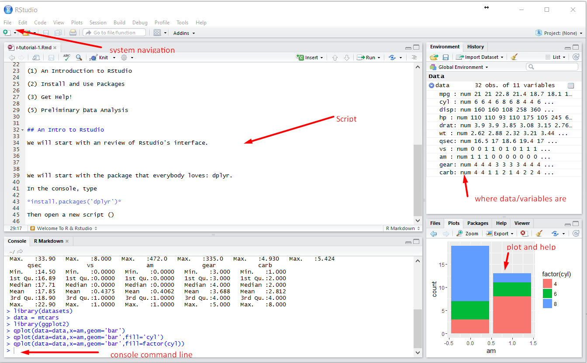

```{r setup, include=FALSE}
knitr::opts_chunk$set(echo = TRUE)
```

## Welcome To R & Rstudio

R is the one of most popular software for data science (+statistics).

Rstudio is one the most popular integrated development environment(IDE) for R.

R has a more active user community than almost any other statistical software and is just as good in many aspects.

In this tutorial, we will learn the basics of R and Rstudio, including:


(1) An Introduction to RStudio

(2) Install and Use Packages

(3) Get Help!

(4) A Taste of Data Science


## An Intro to Rstudio

We will start with a review of Rstudio's interface. Here is everything you need for this tutorial, which is about 5% of RStudio's total functionality. You are encouraged to explore more [here](https://www.youtube.com/watch?v=e_qxDl9xEV8).

- System Navigation

    Open files, create new scripts, and save scripts. That is all for now.

- Script

    The editing area. Write down your program and save it for later(or other people).

- Data/Variables

    Data and variables are the bread and butter for statistical analysis. Open and save dataset here.

- Command line/Result

    Tinker with your code in the console cmd (shortcut for command line) and see the fruit of your labor.

- Plot

    Razzle-dazzle them with fancy lines and stuff.



## Install and Use Package

The power of R lies in the ability to import packages that do all sorts of wonders. We will start with the package that everybody loves: ggplot2.

In the console, type 

>    *install.packages('ggplot2')*

Then open a new script (Click the  icon) and choose R-script. Save it.

In the first line of the script, write
```{r}
library(ggplot2)
```
You will probably see some warnings in red, ignore them.


## Get Help!

The best part of learning Rstudio is that you don't a teacher to become an expert.

The worst part of learning Rstudio is that you don't have someone to hold your hands.

If you are hardcore programmers, try the help function.  For example:

>    *help('qplot')*

The help file of R studio gives you the description, argument explanations and a few examples. 

If you are everybody else, don't panic. You can always Google or Youtube your way out of it. There is a magical website called **Stack Overflow** where all your prayers will be answered. If reading is not your thing, there is a ton of youtube tutorials that walk you through most of the elementary functionalities.

It won't be easy at the beginning if R is your first programming language. But nothing worthwhile in life comes easy. If you want to tag "data science"(or "statistics") in your LinkedIn profile, the gain is worth all the pain.


## A Taste of Data Science

Your boss gives you a dataset of automobile design and performance extracted from the 1974 *Motor Trend* magazine. "Figure something out." is the last word you heard from him.

```{r}
autodata = mtcars
```
The dataset has the following variables:

-     mpg:     Miles/(US) gallon
-     cyl:     Number of cylinders
-     disp:     Displacement (cu.in.)
-     hp:     Gross horsepower
-     drat:     Rear axle ratio
-     wt:     Weight (1000 lbs)
-     qsec:     1/4 mile time
-     vs:     V/S
-     am:     Transmission (0 = automatic, 1 = manual)
-     gear:     Number of forward gears
-     carb:     Number of carburetors


### Summary Statistics

Check summary statistics is always a good habit. The summary statistics gives you the minimum, the maximum, four quartiles and the mean of all continous variables. For factor/logical varaibles, it reports frequency count.

```{r}
summary(autodata)
```


### Recode

The most frequent recoding is to create factor varaibles. For example, am is a factor variable. 0 and 1 means nothing other than a place holder. The following code makes explicit what the value stands for. 

```{r}
autodata$trans = factor(autodata$am, labels=c('automatic','manual'))
```


Now let me explain each component. "autodata" is a dataframe that houses multiple variable. Most data read into R are converted into data frame by default. To extract a variable from the dataframe, use **$**. So

> *dataframe\$variable -> autodata\$trans*

"factor()" is a function. It can take arguments and produce output. In this case, the output is a new variable. In some tutorial, you will see the assignment symbol is not "=" but "<-". For our purpose, it does not matter which one you choose.

> *output = function(arg) ->  autodata\$trans = factor(...)*

"labels=..." changes the default value of the variable assigned by the function. Most R function set default values for auxilary varaibles so as to not overwhelm the user. You can assign custom value when you see fit.

"c('automatic','manual')" is the **list** data type. 'c' is short for concatenate, very 1980s. If you want to assign multiple values at once, usually you need to use the list. In addition, the rank of the string corresponds to the levels of the factor variable. Here 0='automatic'. If you reverse the order of the labels to  c('manual','automatic'), then 0='manual'. Order matters so watch out.


Now summarize the variable gain to get the frequency counts

```{r}
summary(autodata$trans)
```

### Cross tabulates

For frequency count

```{r}
table(autodata$trans, autodata$cyl)
```

If you want to calculate cell percentage

```{r}
ct = table(autodata$trans, autodata$cyl)
prop.table(ct)
```

If you want to have row percentage
```{r}
prop.table(ct,1)
```

and column percentage is 
```{r}
prop.table(ct,2)
```

### Histogram
The native function for calculting histogram is hist. If you want to have the stats from the histogram, extract it from hist_stat.

```{r}
hist_stat =hist(autodata$mpg)
```


I am not a big fan of the native R plotting devices, and so are most of the R users. Do the plotting like a pro with ggplot2.  

The basic grammar of qplot(quick plot) is simple.Here is the code that tells R to plot a 'XXX' figure of variable 1 (and variable 2) of the data frame df. 

> qplot(data=df, x=var1(, y=var2), geom='xxx')


Here is the example with histogram.

```{r,warning=FALSE}
qplot(data=autodata, x=mpg, geom='histogram')
```

You can make it much fancy by diving deep into the [ggplot2](http://docs.ggplot2.org/0.9.3.1/geom_histogram.html).

```{r,warning=FALSE,echo=FALSE}
ggplot(data=autodata, aes(x=mpg))+ 
    geom_histogram(binwidth = 5, aes(y=..density..,fill = ..count..))  + 
    geom_density()
```

### Scatter plot

If you do not specify anything, the qplot function gives you the scatter plot.

```{r}
qplot(data=autodata, x=hp, y=mpg)
```

Overlay the scatter plot with a smoothing function to show the trend.

```{r}
qplot(data=autodata, x=hp, y=mpg) + geom_smooth()
```

Hooray, you have the discovery of the century. If you drive a bigger car, you burn more gasoline.

Your boss will be impressed!


## Exercise

(1) Recode mumber of Cynlinders to a factor varaible with label 'Four','Six','Eight'.

(2) Crosstab number of cynlinders with transimission type

(3) Plot the historgram of weight

(4) Plot the relationship between weight and miles per galon

(5) **Challenge:** Download dplyr, another David Hadley's gift to humanity. Use the group_by() and summarize() to the average mpg by transimission type.
